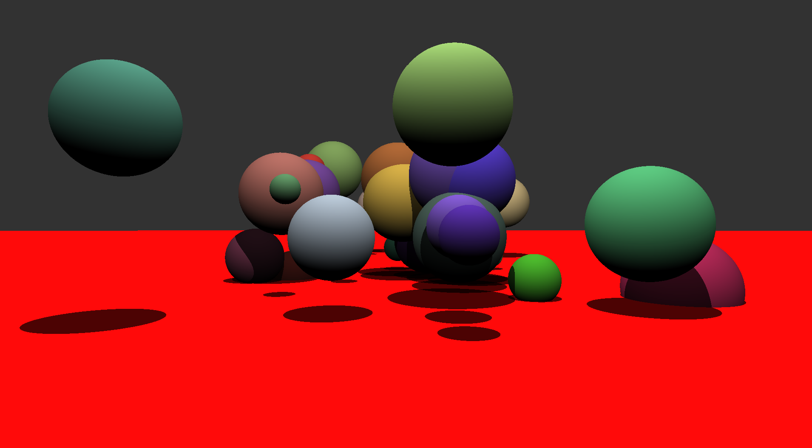
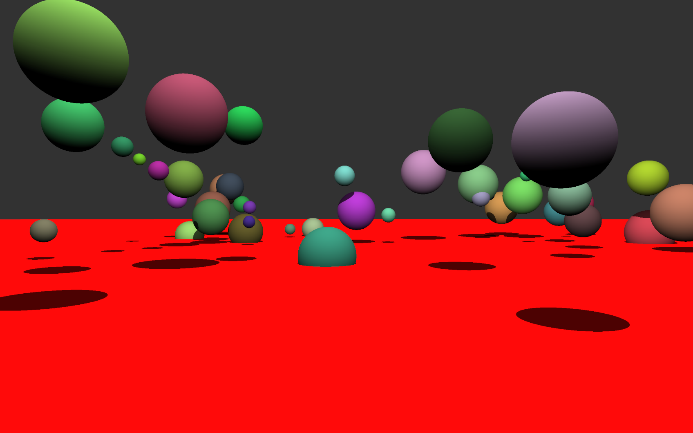

# Multi-Threaded Ray Tracer

## Overview

This ray tracer implements **multi-threading** for improved rendering performance. It supports **spheres** and **planes** using an `Object` base class with derived shape classes. The output is a `.ppm` file, viewable in **GIMP** or other image viewers.

## Examples

## Performance

Tested on an **AMD Ryzen 9 6900HS (16 threads)**, rendering a **2560x1600** scene with **100 random spheres**:

- **Single-threaded:** `13.20s`
- **Multi-threaded:** `2.85s` (4.6× speedup)

## Features

- **Object-Oriented Design**: Uses polymorphism for easy shape expansion.
- **Multi-Threading**: Significantly improves rendering times.
- **Custom Classes**: Includes `Object`, `Color`, `Ray`, `myVector`, `Sphere`, `Plane`, and `Scene`.

## Planned Improvements

- **SFML Integration**: Display results in real-time instead of `.ppm` files.
- **SIMD Optimization**: Improve CPU performance.
- **Better Workload Distribution**: Optimize thread workload distribution.
- **GPU Acceleration**: Possible future migration to GPU friendly framework

## Compilation & Usage

### Build

Now builds with CMake. Use:

`cmake -B build -S .`

I use MSVC so after this, `cd build` and open the .sln file. From there, `f5`.
